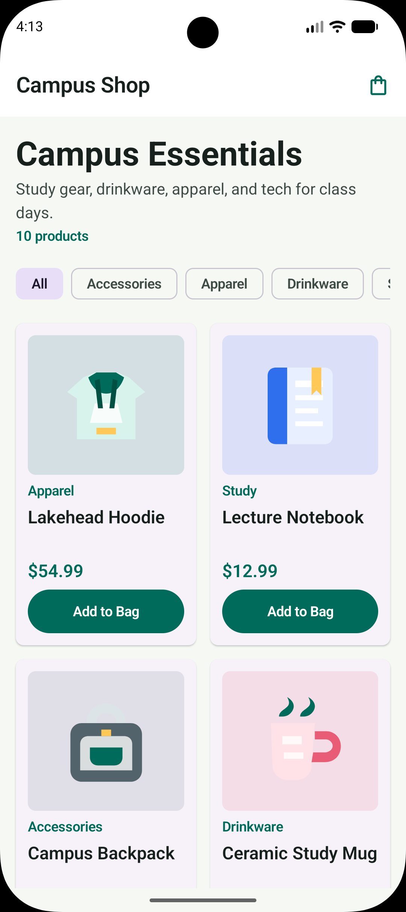
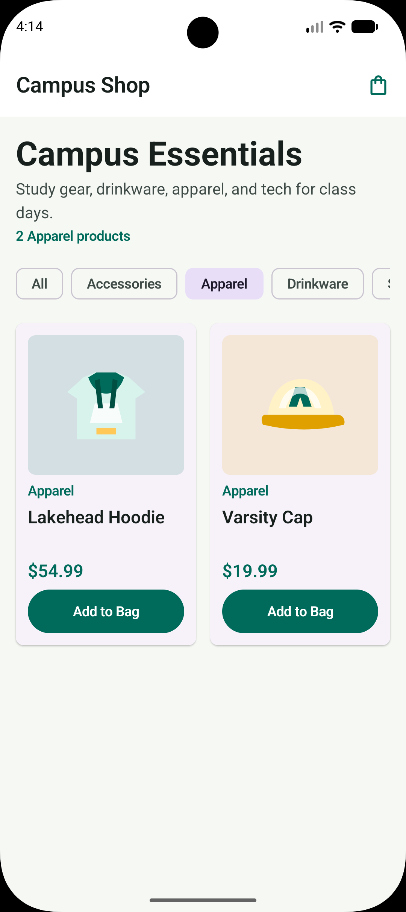
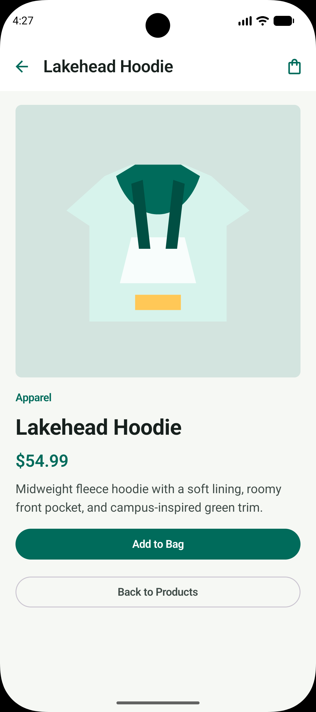
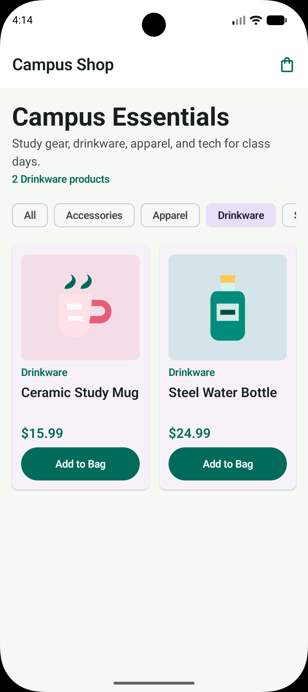
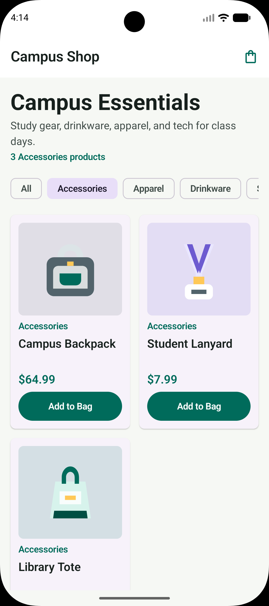
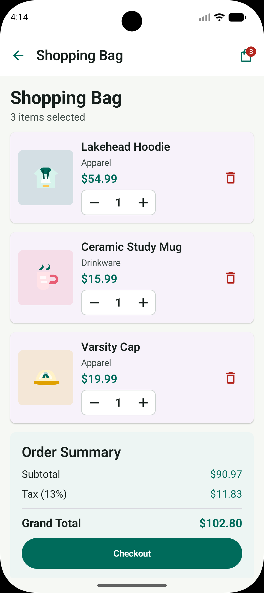
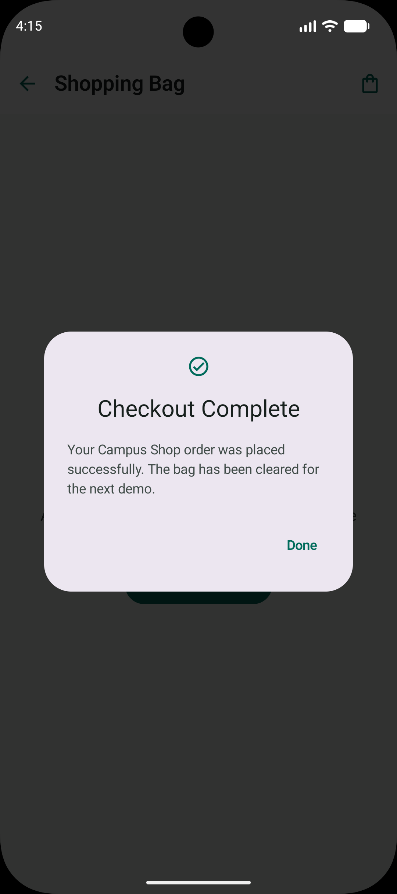
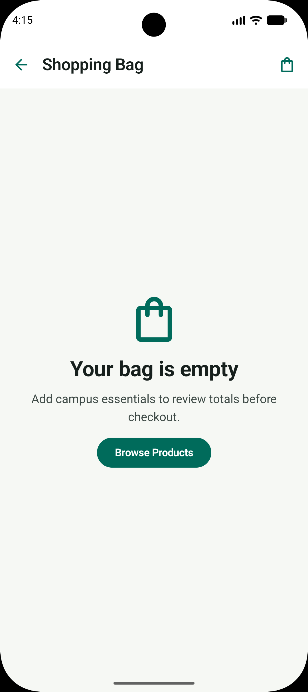

# CS2430 Mobile Programming Exercise 1 - Campus Shop

Luqman Aadil

## Project Overview
Campus Shop is a native Android mobile shop app built with Kotlin and Jetpack Compose for CS2430 Mobile Programming Exercise 1. The app presents a campus store catalog where users can browse products, filter by category, open product details, add items to a shopping bag, adjust quantities, remove items, and review subtotal, 13% tax, and grand total before checkout.

This project uses no Flutter, Firebase, backend, database, login, or payment system. Product data is stored in a simple Kotlin list in `ProductCatalog.kt`, and prices are handled as integer cents to avoid floating-point money errors.

## Tools And Technologies
- Kotlin
- Jetpack Compose
- Material 3
- Navigation Compose
- AndroidX ViewModel with lifecycle-aware state collection
- Local Android vector drawables for product images
- Integer-cent price and total calculations
- Android Studio and Android emulator

## Setup Instructions
1. Install Android Studio.
2. Open the `MobileShopApp` project folder in Android Studio.
3. Wait for Gradle sync to finish.
4. Accept any Android SDK component installation prompts.
5. Use JDK 17 or the JDK bundled with Android Studio.

## Run Instructions
### Android Studio And Emulator
1. Open the project in Android Studio.
2. Select the `app` run configuration.
3. Start an Android emulator, such as Pixel 7 or Pixel 8.
4. Click **Run**.
5. The app should launch as **Campus Shop**.

### Command-Line Build
macOS/Linux:
```bash
./gradlew clean :app:assembleDebug
```

Windows:
```powershell
.\gradlew.bat clean :app:assembleDebug
```

The debug APK is generated under:
```text
app/build/outputs/apk/debug/
```

## Exact Project Structure
Generated folders and private local files such as `.gradle/`, `.kotlin/`, `build/`, `app/build/`, `local.properties`, `.DS_Store`, and Android Studio workspace files are excluded from the submission package.

```text
MobileShopApp/
├── .gitignore
├── AGENTS.md
├── MC_Exercise1_20226NN.pdf
├── README.md
├── README.pdf
├── build.gradle.kts
├── gradle.properties
├── gradlew
├── gradlew.bat
├── settings.gradle.kts
├── gradle/
│   ├── gradle-daemon-jvm.properties
│   ├── libs.versions.toml
│   └── wrapper/
│       ├── gradle-wrapper.jar
│       └── gradle-wrapper.properties
├── screenshots/
│   ├── Screenshot_20260506_041327.png
│   ├── Screenshot_20260506_041348.png
│   ├── Screenshot_20260506_041359.png
│   ├── Screenshot_20260506_041412.png
│   ├── Screenshot_20260506_041421.png
│   ├── Screenshot_20260506_041428.png
│   ├── Screenshot_20260506_041457.png
│   ├── Screenshot_20260506_041505.png
│   ├── Screenshot_20260506_041513.png
│   ├── Screenshot_20260506_041528.png
│   ├── Screenshot_20260506_041545.png
│   └── Screenshot_20260506_042713.png
└── app/
    ├── .gitignore
    ├── build.gradle.kts
    ├── proguard-rules.pro
    └── src/
        ├── main/
        │   ├── AndroidManifest.xml
        │   ├── java/com/example/mobileshopapp/
        │   │   ├── MainActivity.kt
        │   │   ├── data/
        │   │   │   └── ProductCatalog.kt
        │   │   ├── model/
        │   │   │   ├── CartItem.kt
        │   │   │   ├── Product.kt
        │   │   │   └── ShopUiState.kt
        │   │   ├── viewmodel/
        │   │   │   └── ShopViewModel.kt
        │   │   └── ui/
        │   │       ├── components/
        │   │       │   ├── CampusTopBar.kt
        │   │       │   ├── CartLineItem.kt
        │   │       │   ├── CategoryChips.kt
        │   │       │   ├── CheckoutSuccessDialog.kt
        │   │       │   ├── EmptyCartState.kt
        │   │       │   ├── OrderSummary.kt
        │   │       │   ├── PriceText.kt
        │   │       │   ├── ProductCard.kt
        │   │       │   ├── ProductImage.kt
        │   │       │   └── QuantityStepper.kt
        │   │       ├── navigation/
        │   │       │   ├── ShopNavHost.kt
        │   │       │   └── ShopRoute.kt
        │   │       ├── screens/
        │   │       │   ├── CartScreen.kt
        │   │       │   ├── HomeScreen.kt
        │   │       │   └── ProductDetailScreen.kt
        │   │       └── theme/
        │   │           ├── Color.kt
        │   │           ├── Theme.kt
        │   │           └── Type.kt
        │   ├── res/
        │   │   ├── drawable/
        │   │   │   ├── ic_launcher_background.xml
        │   │   │   ├── ic_launcher_foreground.xml
        │   │   │   ├── product_backpack.xml
        │   │   │   ├── product_bottle.xml
        │   │   │   ├── product_cap.xml
        │   │   │   ├── product_hoodie.xml
        │   │   │   ├── product_lamp.xml
        │   │   │   ├── product_lanyard.xml
        │   │   │   ├── product_mug.xml
        │   │   │   ├── product_notebook.xml
        │   │   │   ├── product_tote.xml
        │   │   │   └── product_usb_cable.xml
        │   │   ├── mipmap-anydpi-v26/
        │   │   ├── mipmap-hdpi/
        │   │   ├── mipmap-mdpi/
        │   │   ├── mipmap-xhdpi/
        │   │   ├── mipmap-xxhdpi/
        │   │   ├── mipmap-xxxhdpi/
        │   │   ├── values/
        │   │   │   ├── colors.xml
        │   │   │   ├── strings.xml
        │   │   │   └── themes.xml
        │   │   └── xml/
        │   │       ├── backup_rules.xml
        │   │       └── data_extraction_rules.xml
        └── test/java/com/example/mobileshopapp/viewmodel/
            └── ShopViewModelTest.kt
```

## App Features
- Home screen with a responsive product grid
- Category filter chips
- Product cards with image, name, category, price, and **Add to Bag** button
- Product detail screen
- Shopping bag screen
- Cart badge showing total selected quantity
- Add to cart
- Increase quantity
- Decrease quantity
- Remove item
- Empty cart state
- Subtotal, 13% tax, and grand total
- Checkout button
- Checkout success dialog
- Material 3 light and dark theme support
- Local product assets bundled in the app

## Screenshots
The screenshots below show the main shopping flow and responsive Material 3 interface. All image paths are relative to the project root.

<div class="screenshot-grid">
  <figure>
    
    <figcaption>Home screen product grid</figcaption>
  </figure>
  <figure>
    
    <figcaption>Apparel category filter</figcaption>
  </figure>
  <figure>
    
    <figcaption>Product detail screen</figcaption>
  </figure>
  <figure>
    
    <figcaption>Drinkware category filter</figcaption>
  </figure>
  <figure>
    
    <figcaption>Accessories category filter</figcaption>
  </figure>
  <figure>
    
    <figcaption>Shopping bag with subtotal, tax, and grand total</figcaption>
  </figure>
  <figure>
    
    <figcaption>Checkout complete dialog</figcaption>
  </figure>
  <figure>
    
    <figcaption>Empty shopping bag state</figcaption>
  </figure>
</div>

## Testing Checklist
Use this checklist to verify the required user flow:
1. Launch the app.
2. Confirm the home screen appears.
3. Filter products by category.
4. Open a product detail screen.
5. Add the product to the bag.
6. Add another product from the home screen.
7. Open the shopping bag using the cart icon and badge.
8. Increase quantity.
9. Decrease quantity.
10. Remove an item.
11. Confirm subtotal, 13% tax, and grand total update correctly.
12. Tap checkout and confirm the success dialog appears.
13. Remove all items or complete checkout to confirm the empty bag state.

## Actual Phone Bonus Check
1. Enable Developer Options and USB Debugging on the Android phone.
2. Connect the phone to the computer.
3. Select the phone as the run target in Android Studio.
4. Run the app and repeat the testing checklist.
5. Capture at least one phone screenshot if documenting the bonus run.

## GitHub Repository
Public GitHub repository URL:
```text
https://github.com/luqi101/Mobile_Programming_Exercise_1.git
```
